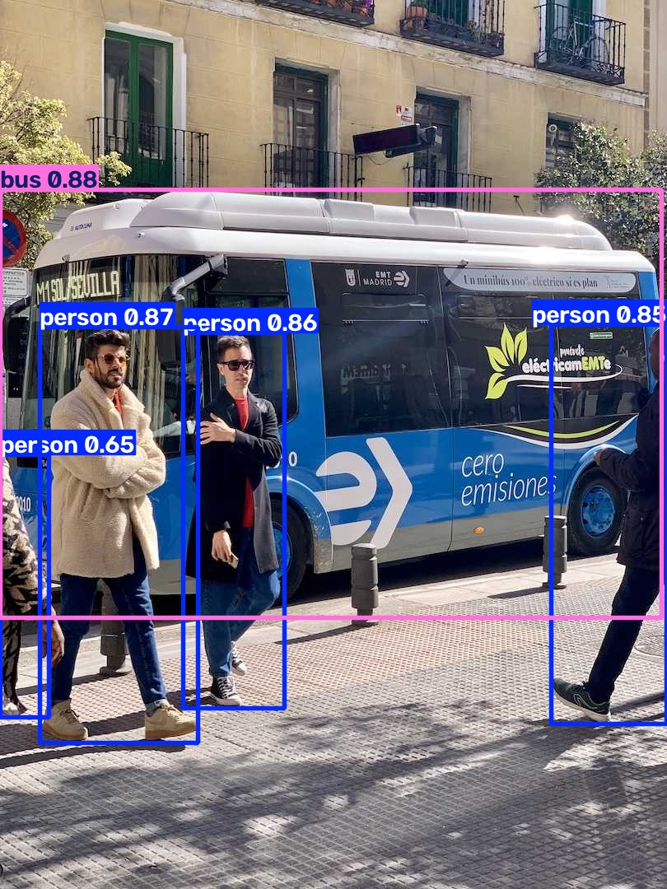
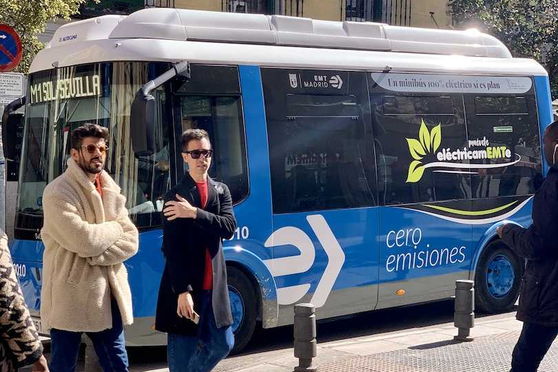
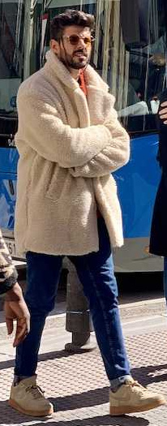

# Detect and Crop

[Ultralytics Object Cropping](https://docs.ultralytics.com/guides/object-cropping/)
detects objects and writes each bounding-box crop to disk. This tutorial makes
the inference, crop side effect, and final rendering explicit pipeline steps.

| Before | After |
|---|---|
|  |  |

## Build the pipeline

`yolo.Predict` returns native `list[Results]`. A single image still produces a
list, so `Select(0)` makes the one native result available to the following
operators. `results.SaveCrop` is a side effect: it saves crops and passes that
same `Results` object to `results.Plot`.

```python
from pathlib import Path

from ml_pipes.core import Pipeline
from ml_pipes.standard import Select
from ml_pipes.ultralytics import results, yolo

pipeline = Pipeline(
    [
        yolo.Predict(model="yolo26n.pt", conf=0.25),
        Select(0),
        results.SaveCrop(Path("crops")),
        results.Plot(save=True, filename="annotated.jpg"),
    ],
    auto_validate=True,
)
```

## Run it on an image

The pipeline accepts the BGR array decoded by OpenCV and returns the annotated
BGR array. Crop writing and annotated-image saving happen inside their
configured result operators.

```python
import cv2

image = cv2.imread("bus.jpg")
if image is None:
    raise RuntimeError("Could not load bus.jpg")

annotated = pipeline(image)
print(annotated.shape)
```

The `bus` and `person` directories below are produced by the `SaveCrop` step.

| `bus/im.jpg` | `person/im.jpg` |
|---|---|
|  |  |

## Run the example

```bash
python examples/run_detect_and_crop.py
python examples/run_detect_and_crop.py --source path/to/image.jpg --show
```

See [`run_detect_and_crop.py`](https://github.com/requiem4machines/ml-pipes-ultralytics/blob/main/examples/run_detect_and_crop.py)
for all command-line options.
