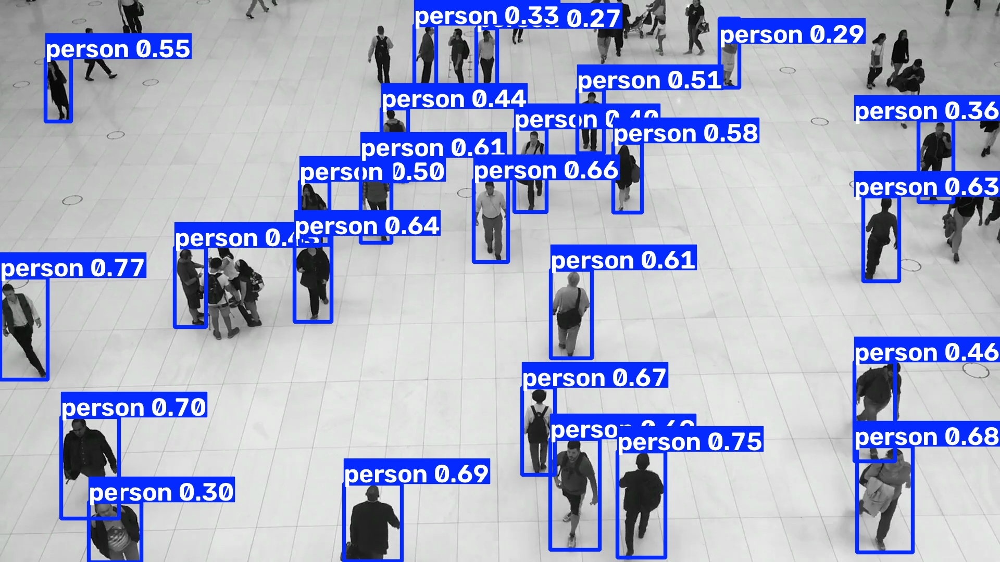

# Detect Objects on Video

[Ultralytics predict mode](https://docs.ultralytics.com/modes/predict/) can
consume a video directly. In a pipeline, an explicit OpenCV loop instead owns
decoding, scheduling, display, and output. The pipeline remains a simple,
non-streaming transformation from one BGR frame to one annotated BGR frame.



## Build the frame pipeline

The pipeline is constructed once and reused for every frame. `yolo.Predict`
returns native results, `Select(0)` chooses the result associated with the
current frame, and `results.Plot` returns an image suitable for a video writer.

```python
from ml_pipes.core import Pipeline
from ml_pipes.standard import Select
from ml_pipes.ultralytics import results, yolo

pipeline = Pipeline(
    [
        yolo.Predict(model="yolo26n.pt", conf=0.25),
        Select(0),
        results.Plot(),
    ],
    auto_validate=True,
)
pipeline.validate()
pipeline.describe()
```

## Feed frames to the pipeline

`VideoCapture` produces one BGR frame at a time. The returned annotated frame
can be displayed, written, or passed to more application-specific processing.

```python
import cv2

cap = cv2.VideoCapture("people-walking.mp4")
if not cap.isOpened():
    raise RuntimeError("Could not open people-walking.mp4")

while cap.isOpened():
    success, frame = cap.read()
    if not success:
        break

    annotated = pipeline(frame)
    # video_writer.write(annotated)
    # cv2.imshow("Detection", annotated)

cap.release()
```

## Run the example

```bash
python examples/run_detection_video.py --input people-walking.mp4 --show
python examples/run_detection_video.py --input 0 --show
```

See [`run_detection_video.py`](https://github.com/trained-by-humans/ml-pipes-ultralytics/blob/main/examples/run_detection_video.py)
for optional MP4 output and inference configuration.
