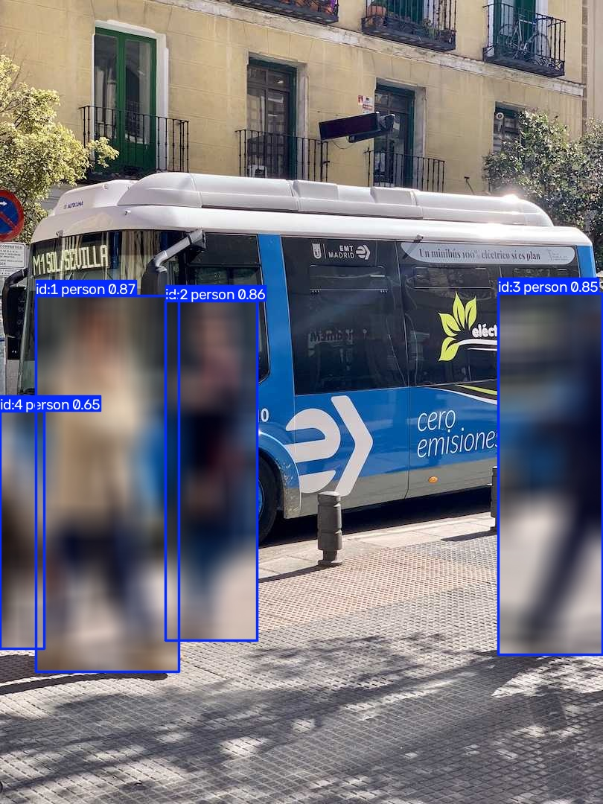

# Blur People

[Ultralytics Object Blurring](https://docs.ultralytics.com/guides/object-blurring/)
is useful for privacy-preserving video and image processing. Rather than hiding
the workflow in a solution class, this tutorial exposes the custom blur step as
one small operator between native tracking and rendering.




## Build the pipeline

The default YOLO checkpoint uses COCO class `0` for `person`, so the tracking
operator filters all other detections before `ObjectBlurrer` receives the
native result. The custom operator copies `results.orig_img`, blurs each box,
and calls `results.plot(img=image)` to draw native annotations over it.

```python
from ml_pipes.core import Pipeline
from ml_pipes.standard import Select
from ml_pipes.ultralytics import yolo

pipeline = Pipeline(
    [
        yolo.Track(
            model="yolo26n.pt",
            persist=True,
            classes=[0],  # COCO person
            tracker="botsort.yaml",
            conf=0.25,
        ),
        Select(0),
        ObjectBlurrer(blur_ratio=0.5),
    ],
    auto_validate=True,
)
```

`ObjectBlurrer` is defined in the runnable example. It is ordinary pipeline
code, so applications can replace it with another effect or add steps before
and after it.

## Run it on an image

```python
import cv2

image = cv2.imread("bus.jpg")
if image is None:
    raise RuntimeError("Could not load bus.jpg")

blurred = pipeline(image)
cv2.imwrite("blurred.jpg", blurred)
```

## Run the example

```bash
python examples/run_object_blurrer.py
python examples/run_object_blurrer.py --source path/to/image.jpg --show
```

See [`run_object_blurrer.py`](https://github.com/requiem4machines/ml-pipes-ultralytics/blob/main/examples/run_object_blurrer.py)
for all command-line options.
