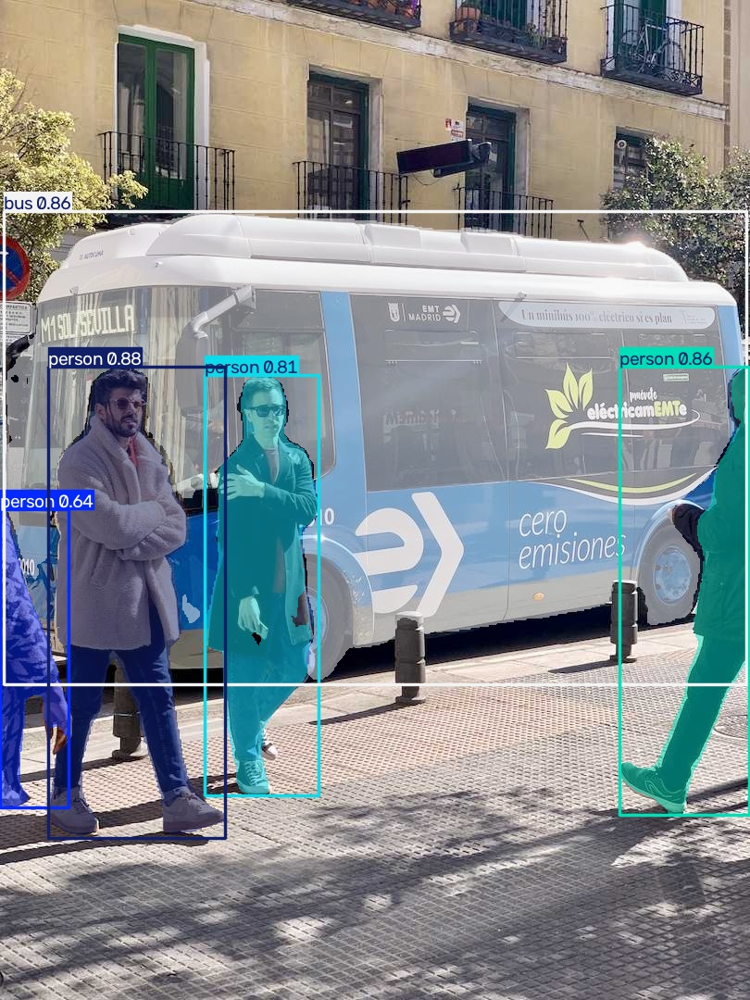

# Segment and Annotate

[Ultralytics instance segmentation](https://docs.ultralytics.com/guides/instance-segmentation-and-tracking/)
adds a mask to every detected instance. This pipeline keeps the native result
intact until the final plotting step, where Ultralytics renders masks, boxes,
labels, and confidence values.




## Build the pipeline

Use a segmentation checkpoint and select the one result for the input image.
`color_mode="instance"` gives each detected instance its own mask colour.

```python
from ml_pipes.core import Pipeline
from ml_pipes.standard import Select
from ml_pipes.ultralytics import results, yolo

pipeline = Pipeline(
    [
        yolo.Predict(model="yolo26n-seg.pt", conf=0.25),
        Select(0),
        results.Plot(
            boxes=True,
            labels=True,
            conf=True,
            color_mode="instance",
            save=True,
            filename="segmented.jpg",
        ),
    ],
    auto_validate=True,
)
```

## Run it on an image

The call boundary contains data only: model and plot configuration were fixed
when the pipeline was built.

```python
import cv2

image = cv2.imread("bus.jpg")
if image is None:
    raise RuntimeError("Could not load bus.jpg")

annotated = pipeline(image)
cv2.imwrite("segmented-copy.jpg", annotated)
```

## Run the example

```bash
python examples/run_segment_and_annotate.py
python examples/run_segment_and_annotate.py --source path/to/image.jpg --show
```

See [`run_segment_and_annotate.py`](https://github.com/requiem4machines/ml-pipes-ultralytics/blob/main/examples/run_segment_and_annotate.py)
for all command-line options.
