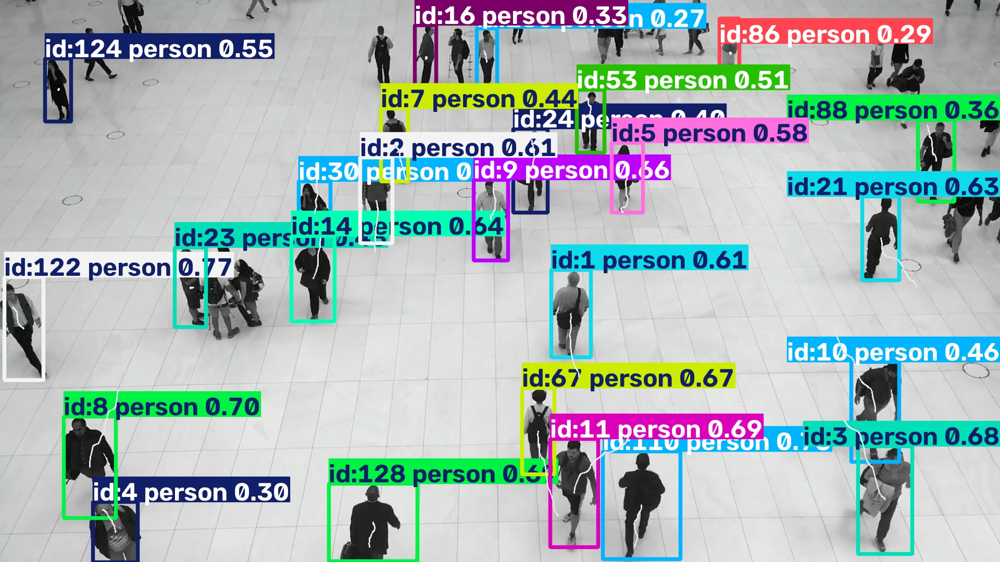

# Track Objects on Video

[Ultralytics track mode](https://docs.ultralytics.com/modes/track/) assigns
stable IDs across frames. This pipeline makes the state explicit: the native
tracker belongs to `yolo.Track(persist=True)`, and the application-level trace
history belongs to a custom `TrackTrace` operator.



## Build the frame pipeline

Build the pipeline once, before opening the video. Keeping the same `Track`
operator instance across calls preserves native tracker state; `TrackTrace`
stores a short deque of centre points for every track ID and draws the paths.

```python
from ml_pipes.core import Pipeline
from ml_pipes.standard import Select
from ml_pipes.ultralytics import yolo

pipeline = Pipeline(
    [
        yolo.Track(
            model="yolo26n.pt",
            persist=True,
            tracker="bytetrack.yaml",
            conf=0.25,
        ),
        Select(0),
        TrackTrace(length=30),
    ],
    auto_validate=True,
)
pipeline.validate()
pipeline.describe()
```

`TrackTrace` is defined in the runnable example. Like the blur step, it is a
small application operator that can be replaced or extended without changing
the native Ultralytics boundary.

## Feed frames to the pipeline

Feed the decoded frames to the same pipeline instance in their original order.
Do not rebuild it inside the loop: doing so would reset both tracker IDs and
trace history.

```python
import cv2

cap = cv2.VideoCapture("people-walking.mp4")
if not cap.isOpened():
    raise RuntimeError("Could not open people-walking.mp4")

while cap.isOpened():
    success, frame = cap.read()
    if not success:
        break

    annotated = pipeline(frame)
    # video_writer.write(annotated)

cap.release()
```

## Run the example

```bash
python examples/run_track_objects.py --input people-walking.mp4 --show
python examples/run_track_objects.py --input 0 --show
```

See [`run_track_objects.py`](https://github.com/trained-by-humans/ml-pipes-ultralytics/blob/main/examples/run_track_objects.py)
for optional MP4 output, track length, and tracker configuration.
